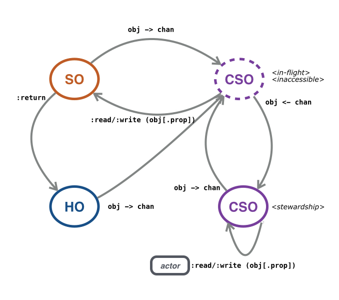

## Communicable Stack Objects for Go

     
###`about`
This document explores the semantics of a modified Go language. It is not a formal specification. That said, we aim to sufficiently define and highlight changes to existing Go langauge so that the existing Go Language Specifications can form an effective and substantial starting point for a formal specification.

The impetus for the work was an interesting conversation in the Go language usenet forum (golang-nuts) centered around introducing some of the foundational ideas of a 'safe' language (Rust and Rust object ownership features, to be specific). Given the relatively limited type system machinery provided by Go, characteristic of its practical usability user niche, the type-system based approach of languages such as Rust and Haskell effectively would require a full rethink of the Go language. 

So that's the background. And the result here is an example of how close we can get to the ideal concurrent programming language -- safe, efficient, reasonable -- with Go (1.5) as the starting point. And how to do this without drowning the concurrent logic (and the programmer) in a bed of syntactic structures, metadata, and rocket-science type systems.

####`stat`

     stardate: 55ddf81c
     state:    draft-init-braindump
     

###`meta-musings`
The current trend in research and development of addressing the challenges of concurrent programming is to rely on semantic structures (type systems) and existing algebraic logic machinery to inject 'semantic intent' into the mix of inputs given to a compiler (or interpretive runtime). While this is clearly a viable and rigorous approach (validated by a number of successful languages), it demands a certain degree of sophistication from the user. It may even be argued that the required sophistication is unreasonable given that the substantial majority of code written are (in terms of domain mechanics) rather mundane variations on the general theme of book-keeping.

Reflecting on our (perceived) reality, we note that we inhabit a highly concurrent world of many actors. Sure we bump into things and each other, but the world remains 'consistent' regardless of our haphazard meanderings and the apparent fact of a lack of a 'global coordinator'. Another interesting observation is that our (perceived) reality is fundamentally governed by thermodynamics, which given an appropriately vigorous squint, is really about how things (matter, energy) shuffle from place to place: dynamics. And further that 'form' (think 'type') is not a primary parameter. What seems to govern our concurrent order are the (perceived) facts of 'spaces', 'objects', 'Pauli Exclusion', and 'pathways of movement'. (Semantics only enter into the (concurrent) picture when perceptions of reality are subject to the psychological machinery of the sentient.) 

So it appears that interactivity governed by a purely spatial regime (and not form/semantics) is sufficient to construct a concurrent world. Our 'interactive world' is the proof. 

Certainly this is not a novel view. In fact CSP, and message based interactivity in general, can be viewed precisely as the spatial approach to concurrency. The issue has never been the conceptual clarity, but rather the performance penalty exacted by uniform copy-on-send semantics of the message passing paradigms.

###`so what is a C.S.O.?`

The general CSP approach is purely logical, and (to my knowledge) does not address the discreet reality of the substrate that support distributed systems. Accordingly, CSP is actor and periphery centric. 

    [actor] -(msg)-> [actor]
    
    peripheral condition: [actor] -> msg
    peripheral condition: [actor] <- msg
    
   
CSO asserts a complementery dual and elevates message as a first class concern, and is message and flow centric. In effect, we are phase shifting CSP's window of conceptual focus.

             [actor] -> (msg) -> [actor]  # CSP view
    (msg) -> [actor] -> (msg)             # CSO view

So while the semantics of message ownership in CSP can be defined by a single parameter model (message flow), the semantics of CSO are defined by the permutation of the modality of reification/entry and egress of messages from/to 'transitional spaces' into the space associated with a singular actor.

    emergence: {created, provided, msg-received}
    egress:    {discard, return,   msg-sent}
    
Given this altered view, CSO can augment CSP by defining 'identity' and 'ownership' semantics of the messages exchanges by CSPs in terms of the modality of the 'passage' of the message. CSOs maintain their unique identity as they transition from one actor value space to another. In a way, we are treating message objects as passive mobile agent.

###`memory object modalities`

Memory objects are typically considered heap or stack objects. CSO introduces an additional modality of communicable stack objects. The transitions between these modalities are well defined.

(note: LC is acronym for life-cycle.)

| emergence  | egress | semantics |
| ----------- | --- | --------- |
| new obj | discarded | SO -> SO : actor private |
| new obj | returned | SO -> HO : actor heap scoped LC |
| new obj | obj ->c | SO -> CSO : converted to CSO : local ref copy-on-access actor private |
| IN_ARG obj | discarded | SO -> SO : function scoped LC |
| IN_ARG obj | returned | SO -> SO : actor private |
| IN_ARG obj | obj ->c | SO -> CSO : converted to CSO : local ref copy-on-access actor private |
| obj <-c | discarded | CSO -> SO : CSO LC terminate |
| obj <-c | returned | CSO -> HO : CSO LC terminate : SO/HO copy created |
| obj <-c | obj ->c | CSO -> CSO : note that CSO identity/image is preserved |

###`memory object conversion (patterns)`

Heap and/or stack object is converted to an CSO on a channel send.

    // CSO creation pattern - 
    func foo(..., argx, ...) (..., T, ...) {
    
        // unlike stack objects, objects passed as arguments
        // to the enclosing scope of channel sends (e.g. the function)
        // are copied to a new CSO. 
        argx -> channel // copy is sent. argx remains argx.
        
    	// Stack object created
        var v T
        
		// touch and play
		v.foo = ...
		... = v.bar
		
		// SO -> CSO conversion
		// note compiler can trivially optimize this ephemeral
		// existence of v as an SO given the subsequent send.
		v -> channel // reference is sent. 
		
		// reference v is a lazy eval copy of CSO that was sent.
		// This SO copy is made only on subsequent access (if any).
		// this new SO behaves according to existing semantics
		// of stack objects.
		print (v.foo)  // copy only happens now.
		
		// another example in same scope
		var v2 T
		v2 -> channel
		
		// note: reference v2 is available
		// but not yet copied.
		
		var v3 T
		v3 -> channel
	
		// returning reference to SO/HO that was converted to CSO
		// will cause a copy-on-access	
		return ..., v3, ... // copy only happens now.
    }
    
Exclusive isolated access to CSOs is granted to receiving actor on channel receives. This exlusive critical section is bounded by the paired channel receive and send.

Note that this pairing *must* occur in the same function. (Because of libraries. More on this below.)

Further note that beyond the general concurrency concerns, this in effect provides the necessary semantics for atomic, isolated, and consistent transactions. (Think, for example, of a channel-based network that embodies the domain model transitions. Here, the CSOs corresponding to domain entities are in effect mobile monitors.)

    func workflow (...) ... {    
		
		cso := <- channel // begin exclusive access
		
		// touch and play
		cso.foo = ...
		print(cso.bar)
		...
		
		cso -> channel    // relinquish control
		
		// any furuther access to var cso will affect 
		// a lazy copy of *value* sent to channel
		// the CSO is not modified, of course.

		print(cso)       // copy occcures here
		
		...
    }		
    
What about function calls? What about passing CSO references to 3rd party libraries? To address these concerns, we note the following:

* An CSO reference passed to any function will appear as generic stack arguments to the receiving function. The reference will, however, be distinguished by a tag. Conversions per spec.

* Sending a CSO object in a nested function will send a clone. The CSO is treated as if it was a private HO/SO. This conversion is again per the general spec.

         
      func toplevel (...) ... {
         cso := <- channel
         
         // perfectly safe (isolated), even if calling a 3rd party blackbox.
         mutate(cso)       
         mutateAgain(cso) 
         cso -> channel
      }    
     
      // potentially a third party func
      func mutate(cso T) ... {
     
         // touch and play
         // this is accessing/mutating the CSO
         cso.foo = ...
         print(cso.bar)
         ...
         return
      }    
         
      // potentially a third party func
      func mutateAgain(cso T) ... {
     
         cso.foo = ...
         print(cso.bar)
         
         // this is NOT sending the CSO but a clone.
         cso -> someOtherChannel
         
         go func(obj T) {
         	 // obj is NOT the same object as cso
         	 // per goroutine semantics (see "monadic chipmunk")
             obj.foo = ...
             print (foo.bar)
             
             obj -> anotherChannel // this is a NEW CSO
             
             ...
         }(cso)
         ...
         return
      }    

So we'll see that the CSO invariants hold under composition, given a slight change to goroutine initialization semantics.
         
###`the hermetic existence of the monadic chipmunk`

Goroutines in Go are communal: they can share memory. Goroutines in the CSP/CSO scheme, in contrast, live the monastic life. They share nothing and interact only via CSO objects (messages). It would appear that the scheduling regime ( pre-emptive, run-to-completion, etc.) does not affect the CSO semantics and the required isolation. But goroutine creation semantics require a slight adjustment.

Per our conceptual view, an actor has an addressable value space. This space is fully isolated. Memory object are reified in the actor's value space via standard object creation, IO, or messaging, with the latter being a shared object subject to strictly serialized change of stewardship and **logical** containment.

      // create a go routine
      // note that only reference types with atomic semantics
      // are passed by reference. Value types are cloned. Reference
      // types are deep-copied.
      
      inchan := make(chan T)
      outchan := make(chan T)
      
      s := "destined to be copied"
      m := make(map[K]T)
      
      go func(input, output chan T, s0 string, m0 map[K]T) {
      	  // input and inchan reference the same object
      	  // output and outchan reference the same object
      	  // s0 and s are distinct 
      	  // m0 and m are distinct 
          for msg := range input {
             
             // msg is a CSO
             msg.foo = ...
             ... = msg.bar
             
             msg ->output
          }
       }(inchan, outchan, s, m)
       
       ...
       
So global vars notwithstanding -- and we'll address these later -- any goroutine addressable memory object is either an exclusively addressable (and effectively owned) heap or stack object, or, a communicated CSO that is received via a channel. It should be self evident that this removes any possibility for concurrent access to memory objects.

			 

